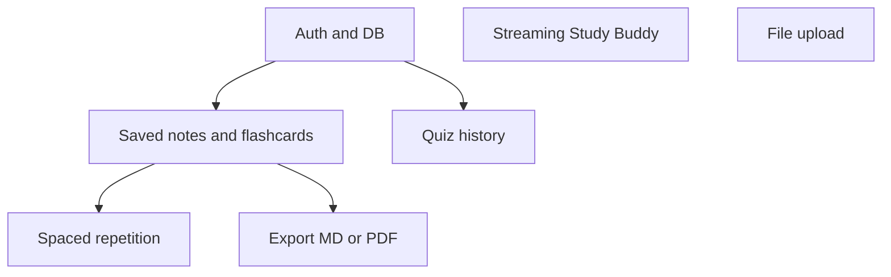

# GapCloser AI — development roadmap (post-MVP)

Ordered suggestion for **Phase C** and beyond. Each item assumes the MVP in `README.md` stays stable unless noted.

## 1. Persistence and accounts

- Add **Supabase** (or similar): Postgres + auth.
- **Saved notes** — store Notes Builder output per user; list + open + delete.
- **Saved flashcards** — persist generated decks; optional edit.
- **Quiz history** — store attempts and scores; link to `topicId`.

## 2. Real-time UX

- **Gemini streaming** for Study Buddy (SSE or chunked response from Route Handler).
- Optional: streaming for long Markdown outputs (notes, final exam packet).

## 3. Study loop

- **Spaced repetition** for saved flashcards (SM-2–style or simple intervals).
- **Final exam simulator** — timed mixed quiz across weak topics using saved progress.

## 4. Inputs and exports

- **File upload** for syllabus/lectures (server parse, size limits, no API key exposure).
- **Export** portfolio artifacts to Markdown download; optional PDF (e.g. print stylesheet or server renderer).

## 5. Optional enhancements

- Voice **teach-back** (STT → same teach-back JSON route).
- Richer analytics on gap-check trends over time (requires DB).

## Dependencies (high level)

Start with **auth + DB**, then **saved notes/flashcards**, then **streaming** or **SR** depending on whether latency or retention matters more for your course timeline.
